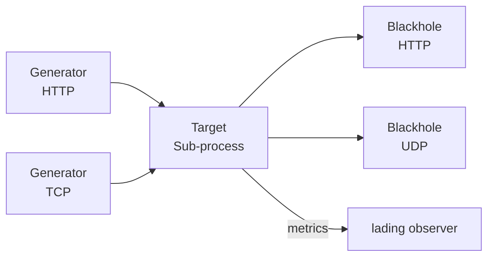

lading is built around three cooperating components that together produce a controlled, repeatable measurement environment. Understanding how they interact is the foundation for everything else in the tool.

## The pipeline

```
Generator(s)  -->  Target  -->  Blackhole(s)
```

Load flows in one direction. Generators push synthetic traffic into the target. The target — the program being measured — processes that traffic and may emit its own output. Blackholes absorb that output so the target is never blocked waiting for a downstream consumer.



lading itself sits outside the data path, observing the target process via the operating system rather than intercepting its data.

## How lading wraps a target

In **binary launch mode**, lading spawns the target as a child process. It manages the full lifecycle: starting, monitoring, and signalling `SIGTERM` on shutdown. If the target crashes, lading detects the unexpected exit and performs a controlled shutdown.

In **PID watch mode**, the target is already running. lading attaches to it by PID and observes it for the duration of the experiment. The target should remain running until lading exits; early termination is treated as an error.

In **container watch mode**, lading queries the Docker socket to resolve the container name to a PID, then falls back to the same PID-watch logic.

In all three modes, lading exposes resource consumption data through a Prometheus endpoint or by writing newline-delimited JSON to disk.

<Info>
See [Targets](/concepts/targets) for configuration details and capability requirements.
</Info>

## Pre-computation philosophy

A performance measurement tool that introduces variable latency into its own load generation cannot be trusted. lading solves this with a strict pre-computation rule: **payloads are fully generated at startup**, before any load is sent.

At initialization, each generator builds a block cache — a fixed pool of ready-to-send payload bytes. During the experiment the generator cycles through this cache in a tight loop, performing only memory reads and I/O. No serialization, no allocation, no randomness occurs on the hot path.

The trade-off is explicit:

| Pre-computation | Just-in-time generation |
|---|---|
| Higher startup latency | Faster startup |
| Higher memory use (configurable) | Lower memory use |
| Zero runtime CPU overhead for payload generation | Variable CPU overhead |
| Predictable, constant lading overhead | Variable lading overhead |

Block cache size is controlled by `maximum_prebuild_cache_size_bytes` in the generator configuration.

<Tip>
For long experiments the cache cycles. A 256 MiB cache provides substantial payload variety for most protocol types before repeating.
</Tip>

## Determinism guarantee

lading's most important property is **reproducibility**: given identical configuration and the same seed, lading produces byte-identical load across every run.

This is enforced at every level:

- All randomness flows through explicitly seeded RNGs. `thread_rng()` is never used in payload generation.
- Ordered collections (`IndexMap`/`IndexSet`) are used wherever iteration order affects output.
- No wall-clock time is read during payload generation.
- Seeds are logged at startup so any run can be reproduced exactly.

```yaml
generator:
  - http:
      seed: [2, 3, 5, 7, 11, 13, 19, 23, 29, 31, 37, 41, 43, 47, 53, 59,
             61, 67, 71, 73, 79, 83, 89, 97, 101, 103, 107, 109, 113, 127, 131, 137]
      target_uri: "http://localhost:8282/"
      bytes_per_second: "100 MiB"
```

If no seed is provided, lading generates one and logs it so the run can be reproduced.

## The three components

<CardGroup cols={3}>
  <Card title="Generators" icon="arrow-right" href="/concepts/generators">
    Create synthetic load and push it into the target over a chosen protocol.
  </Card>
  <Card title="Targets" icon="microchip" href="/concepts/targets">
    The program under measurement. lading launches, watches, and collects resource metrics from the target.
  </Card>
  <Card title="Blackholes" icon="circle-dot" href="/concepts/blackholes">
    Listen for target output and absorb it without backpressuring the target.
  </Card>
</CardGroup>
